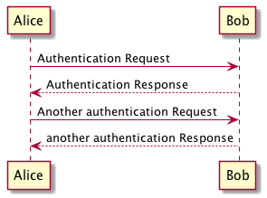

This project allows creating plant uml diagrams in ascii doc files. The gradle build
will continuously watch the source files and generate html output when you make changes.

if you include a block like this in your .adoc file:

```
[plantuml, "asciidoctor-sequence-diagram", "png"]
----
Alice -> Bob: Authentication Request
Bob --> Alice: Authentication Response

Alice -> Bob: Another authentication Request
Alice <-- Bob: another authentication Response
----

```

it will render like this in html output dir: 


To kick off the continuous build with gradle:

`./gradlew bake --continuous`

The output will be generated in build/output
Changes to the source files will be detected automatically by gradle (--continuous)


To the make `<img src="/img/..."` work in generated html you best serve the output over http. 

We could create a gradle task to serve content with gretty.
but for now we just use jbake command to serve content.

install jbake with
`brew install jbake`


serve static content with
`jbake -s build/output`
